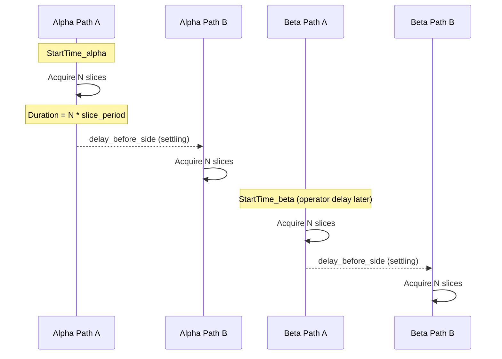

# Fix Temporal Alignment Logic and Remove Enhanced File Handling

## Background Understanding

Based on the diSPIM plugin documentation and Slack conversation with Konstantinos/Jon:

1. **`acquireBothCamerasSimultaneously=False`** (current setting): "While one camera is reading out the other is acquiring" - Path A acquires full volume THEN Path B acquires full volume
2. **`firstSideIsA=True`** (from metadata): Determines which path acquires first within each arm
3. **`delayBeforeSide=0.25`**: Settling time (NOT a temporal offset for alignment) - lets mechanics settle after moving light-sheet objective
4. **Inter-arm timing**: Operator manually clicks to start each arm, so `StartTime` difference gives the offset



---

## PART 1: Fix Temporal Alignment

### Issue

Current code assumes Path A (cam0) always starts first when `acquireBothCamerasSimultaneously=False`, but the `first_side_is_a` metadata field should determine this.

### Changes to [dispim_utils.py](dispim_utils.py)

#### 1. Update `calculate_temporal_alignment()` (~line 806-840)

Add `first_side_is_a` handling to correctly calculate which path has the offset:

```python
# Get which side starts first for each arm
alpha_first_side_is_a = alpha_meta.get('first_side_is_a', True)
beta_first_side_is_a = beta_meta.get('first_side_is_a', True)

if not alpha_simultaneous:
    path_b_offset = (alpha_total_slices * alpha_slice_period + alpha_delay_before_side) * 1000.0
    if alpha_first_side_is_a:
        # Path A starts first: cam0 at t=0, cam1 offset by path_b_offset
        alpha_cam0_offset = 0.0
        alpha_cam1_offset = path_b_offset
    else:
        # Path B starts first: cam1 at t=0, cam0 offset by path_b_offset
        alpha_cam0_offset = path_b_offset
        alpha_cam1_offset = 0.0
```

Return new fields:

- `alpha_first_side_is_a`, `beta_first_side_is_a`
- `alpha_cam0_offset_ms`, `alpha_cam1_offset_ms` (instead of just `alpha_path_b_offset_ms`)
- `beta_cam0_offset_ms`, `beta_cam1_offset_ms`

#### 2. Update `load_temporally_aligned_stacks()` (~line 1000-1031)

Use the per-camera offsets to build correct time vectors:

```python
# Get per-camera offsets (already accounts for first_side_is_a)
alpha_cam0_offset_sec = temporal_info['alpha_cam0_offset_ms'] / 1000.0
alpha_cam1_offset_sec = temporal_info['alpha_cam1_offset_ms'] / 1000.0

times_alpha_cam0 = np.arange(num_slices) * alpha_slice_period + alpha_cam0_offset_sec
times_alpha_cam1 = np.arange(num_slices) * alpha_slice_period + alpha_cam1_offset_sec
```

#### 3. Update verbose output (~line 1058-1077)

Show which path started first and the actual offsets for each camera.

---

## PART 2: Remove Enhanced File Handling

### Changes to [dispim_utils.py](dispim_utils.py)

#### 1. Delete `find_enhanced_or_raw()` function (lines 406-447)

Remove this function entirely.

#### 2. Simplify `discover_acquisitions()` (lines 450-555)

- Remove `use_enhanced` parameter
- Remove all enhanced file checking logic
- Remove `using_enhanced`, `alpha_using_enhanced`, `beta_using_enhanced` from returned dict
- Simply find the single `.ome.tif` file in each directory

Before:

```python
def discover_acquisitions(root_dir='.', use_enhanced=True):
    ...
    alpha_tiff, alpha_using_enhanced = find_enhanced_or_raw(alpha_tiff_raw, use_enhanced)
    ...
    acquisitions.append({
        ...
        'using_enhanced': using_enhanced,
        'alpha_using_enhanced': alpha_using_enhanced,
        'beta_using_enhanced': beta_using_enhanced
    })
```

After:

```python
def discover_acquisitions(root_dir='.'):
    ...
    # Simply use the OME-TIFF file found
    acquisitions.append({
        ...
        'alpha_tiff': alpha_tiff,
        'beta_tiff': beta_tiff,
        # No enhanced fields
    })
```

### Changes to [dispim_pipeline.ipynb](dispim_pipeline.ipynb)

#### 1. Remove `USE_ENHANCED_DATA` configuration (cell ~lines 122-133)

Remove:

```python
USE_ENHANCED_DATA = False
```

#### 2. Update `discover_acquisitions` call

Change from:

```python
acquisitions = discover_acquisitions('./datasets', use_enhanced=USE_ENHANCED_DATA)
```

To:

```python
acquisitions = discover_acquisitions('./datasets')
```

#### 3. Remove enhanced status display logic (lines 136-152)

Remove the conditional logic checking `using_enhanced`, `alpha_using_enhanced`, `beta_using_enhanced`.

---

## Summary of Changes

| File | Action |

|------|--------|

| `dispim_utils.py` | Update `calculate_temporal_alignment()` to use `first_side_is_a` |

| `dispim_utils.py` | Update `load_temporally_aligned_stacks()` to use per-camera offsets |

| `dispim_utils.py` | Delete `find_enhanced_or_raw()` function |

| `dispim_utils.py` | Simplify `discover_acquisitions()` - remove enhanced handling |

| `dispim_pipeline.ipynb` | Remove `USE_ENHANCED_DATA` config and related display logic |

---

## What We Keep

- **CLAHE programmatic preprocessing** (`apply_clahe` parameter) - this is applied directly in Python
- **Temporal alignment logic** for both acquisition modes (sequential volumes vs simultaneous cameras)
- **Inter-arm alignment** using `StartTime` differences